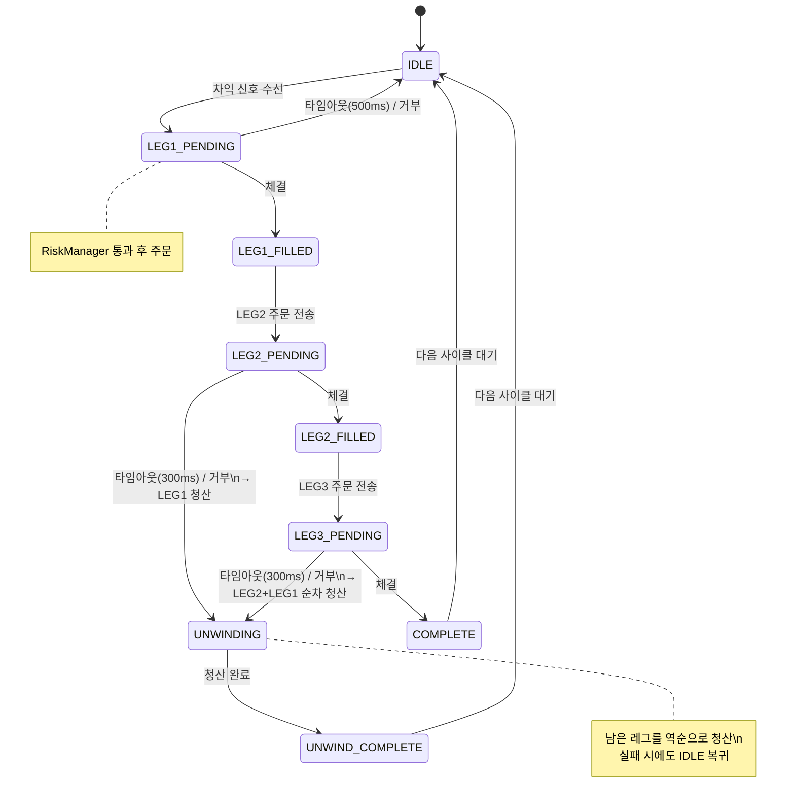

# Atlas Trading

오픈소스 암호화폐 자동매매 / 자산관리 플랫폼.

거래소 API를 인터페이스로 추상화하여 어댑터만 추가하면 새 거래소를 지원합니다.
Mac Mini 홈서버를 1차 타겟으로 설계되었습니다.

## 아키텍처

```
atlas-trading/
├── core-platform/      트레이딩 엔진 (Python asyncio, EDA)
├── api-server/         FastAPI 어드민 서버
├── web-dashboard/      React 어드민 대시보드
├── cluster-config/     K8s / ArgoCD
├── infrastructure/     PostgreSQL + TimescaleDB, Redis, Prometheus
└── docs/
```

### 핵심 설계 원칙

- **핫 패스 DB-free**: 전략 실행 경로에 DB I/O 없음. WebSocket → EventBus → 전략 → 주문이 in-memory로 흐름
- **아웃박스 패턴**: 로깅 / 알림 등 사이드 이펙트는 핵심 로직 완료 후 아웃박스 워커가 처리
- **RiskManager 게이트**: 모든 주문은 RiskManager를 반드시 통과. 우회 불가
- **Backtest = Live**: 이벤트 소스만 다를 뿐 전략과 실행 엔진은 동일한 코드
- **데이터 불변성**: raw 데이터는 append-only. normalized는 raw에서 파생

## 삼각 차익거래 StateMachine

삼각 차익거래(A→B→C→A) 실행 흐름. 각 레그는 타임아웃 내 미체결 시 자동 청산(Unwind).



## 전략 로드맵

| 단계 | 전략 | 상태 |
|------|------|------|
| Phase 1 | 삼각 차익거래 (Bellman-Ford) | 개발 중 |
| Phase 2 | 펀딩피 수익화 | 예정 |
| Phase 3 | 옵션 매매 | 예정 |

## 시작하기

```bash
cd core-platform
uv venv && source .venv/bin/activate
uv pip install -e .
```

## 문서

- [아키텍처 설계](docs/architecture.md)
- [시스템 설계 스펙](docs/superpowers/specs/2026-05-31-atlas-trading-redesign.md)
- [운영 가이드](docs/runbook.md)
- [보안 정책](docs/security.md)

## 보안

- API 키는 Kubernetes Sealed Secrets로 관리 (평문 금지)
- 거래소 API 키에 출금 권한 절대 부여 금지
- RiskManager Kill Switch: Redis 플래그로 전체 거래 즉시 중단 가능
- Fail-Closed: 불확실하면 거래 중단

---

**주의**: 이 시스템은 실제 자금을 다룹니다. 충분한 검증 없이 실전 운용을 절대 금지합니다.
